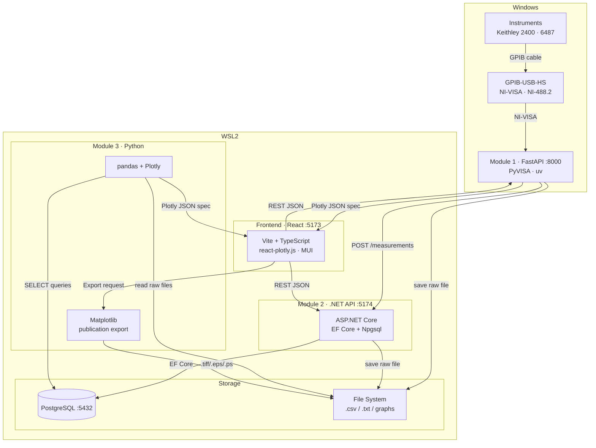

The following architecture and tools are adopted as the first iteration:

**Module 1:** Python to connect and control devices.
- Runs on **Windows** due to GPIB hardware constraints (NI-VISA and NI-488.2 cannot be used via WSL2)
- Served as a **FastAPI** HTTP server on port 8000, reachable from WSL2

**Module 2:** .NET to connect with databases, with PostgreSQL as the database.
- Runs in **WSL2**

**Module 3:** Python for data analysis and visualization.
- Runs in **WSL2**
- **Plotly** — interactive graphs rendered in the React frontend (zoom, pan, range selection, drag-and-drop annotations). `react-plotly.js` is used on the frontend side.
- **Matplotlib** — publication export only. When the user is satisfied with the graph, the backend renders it with Matplotlib and saves `.tiff`, `.eps`, or `.ps`. No interactivity required from Matplotlib.

**Interface:** React — runs in **WSL2**

**Database:** PostgreSQL — runs in **WSL2**

**Database design:** The app will provide a default database for most users and tools (maybe a web interface) that allows advanced users to design and create their own databases. Embedded PostgreSQL will be used.

---

## Deployment Environments

```
Windows (Instrument Control)
├── NI-VISA + NI-488.2          GPIB hardware drivers
├── Module 1 · FastAPI (:8000)  instrument control + graph triggers
│   ├── PyVISA                  talks to instruments via GPIB
│   └── uv                      package manager
└── GPIB-USB-HS adapter         physical connection to instruments

WSL2 (Data + UI)
├── Module 2 · .NET API (:5174) data management
│   ├── ASP.NET Core
│   ├── EF Core + Npgsql
│   └── PostgreSQL (:5432)
├── Module 3 · Python           analysis + graph generation
│   ├── pandas
│   ├── Plotly                  returns JSON spec to frontend
│   ├── Matplotlib              publication export
│   └── uv
└── Frontend · React (:5173)
    ├── Vite + TypeScript
    ├── react-plotly.js         renders Plotly JSON from Module 3
    ├── MUI                     UI components
    └── React Query             server state management
```

---

## Data Flow


```mermaid
flowchart TB
    subgraph WIN[Windows]
        INST[Instruments\nKeithley 2400 · 6487]
        GPIB[GPIB-USB-HS\nNI-VISA · NI-488.2]
        M1[Module 1 · FastAPI :8000\nPyVISA · uv]
    end

    subgraph WSL2[WSL2]
        subgraph M2[Module 2 · .NET API :5174]
            API[ASP.NET Core\nEF Core + Npgsql]
        end

        subgraph M3[Module 3 · Python]
            PY[pandas + Plotly]
            MPL[Matplotlib\npublication export]
        end

        subgraph Store[Storage]
            PG[(PostgreSQL :5432)]
            FS[File System\n.csv / .txt / graphs]
        end

        subgraph FE[Frontend · React :5173]
            UI[Vite + TypeScript\nreact-plotly.js · MUI]
        end
    end

    INST -->|GPIB cable| GPIB
    GPIB -->|NI-VISA| M1
    M1   -->|POST /measurements| API
    M1   -->|save raw file| FS
    M1   -->|Plotly JSON spec| UI
    API  -->|EF Core| PG
    API  -->|save raw file| FS
    UI   -->|REST JSON| API
    UI   -->|REST JSON| M1
    PY   -->|SELECT queries| PG
    PY   -->|read raw files| FS
    PY   -->|Plotly JSON spec| UI
    UI   -->|Export request| MPL
    MPL  -->|.tiff/.eps/.ps| FS
```

---

## API Boundaries

| Frontend calls | Endpoint | Purpose |
|---|---|---|
| `http://localhost:5174` | .NET API | batches, samples, devices, measurements, equipment |
| `http://<windows-ip>:8000` | FastAPI (Windows) | connect to instrument, run measurement, get graph |

| FastAPI calls | Target | Purpose |
|---|---|---|
| PyVISA | Instruments via GPIB | send commands, read data |
| `http://localhost:5174` | .NET API | POST measurement metadata after acquisition |