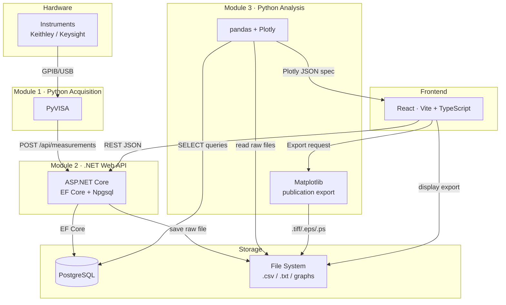

The following architecture and tools are adopted as the first iteration:

**Module 1:** Python to connect and control devices.

**Module 2:** .NET to connect with databases, with PostgreSQL as the database.

**Module 3:** Python for data analysis and visualization.
- **Plotly** — interactive graphs rendered in the React frontend (zoom, pan, range selection, drag-and-drop annotations). `react-plotly.js` is used on the frontend side.
- **Matplotlib** — publication export only. When the user is satisfied with the graph, the backend renders it with Matplotlib and saves `.tiff`, `.eps`, or `.ps`. No interactivity required from Matplotlib.

**Interface:** React

**Database design:** The app will provide a default database for most users and tools (maybe a web interface) that allows advanced users to design and create their own databases. Embedded PostgreSQL will be used.

