The following architecture and tools are adopted as the first iteration:

**Module 1:** Python to connect and control devices.
**Module 2:** .NET to connect with databases, with PostgreSQL as the database.
**Module 3:** Python for data analysis and visualization.

**Interface:** React

**Database design:** The app will provide a default database for most users and tools (maybe a web interface) that allows advanced users to design and create their own databases. Embedded PostgreSQL will be used.

```mermaid
flowchart TB
    subgraph HW[Hardware]
        INST[Instruments\nKeithley / Keysight]
    end

    subgraph M1[Module 1 · Python Acquisition]
        VISA[PyVISA]
    end

    subgraph M2[Module 2 · .NET Web API]
        API[ASP.NET Core\nEF Core + Npgsql]
    end

    subgraph M3[Module 3 · Python Analysis]
        PY[pandas + Matplotlib]
    end

    subgraph Store[Storage]
        PG[(PostgreSQL)]
        FS[File System\n.csv / .txt / graphs]
    end

    subgraph FE[Frontend]
        UI[React · Vite + TypeScript]
    end

    INST -->|GPIB/USB| VISA
    VISA -->|POST /api/measurements| API
    API -->|EF Core| PG
    API -->|save raw file| FS
    UI  -->|REST JSON| API
    PY  -->|SELECT queries| PG
    PY  -->|read raw files| FS
    PY  -->|write graph| FS
    UI  -->|display graph| FS
```

