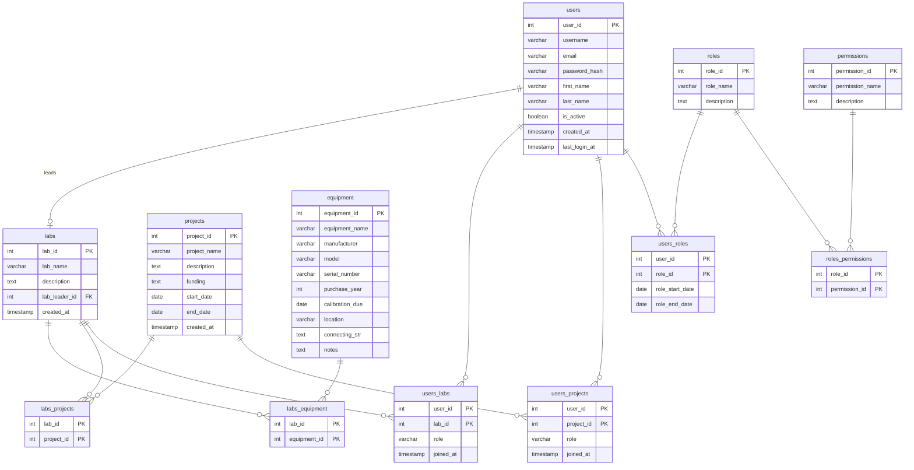
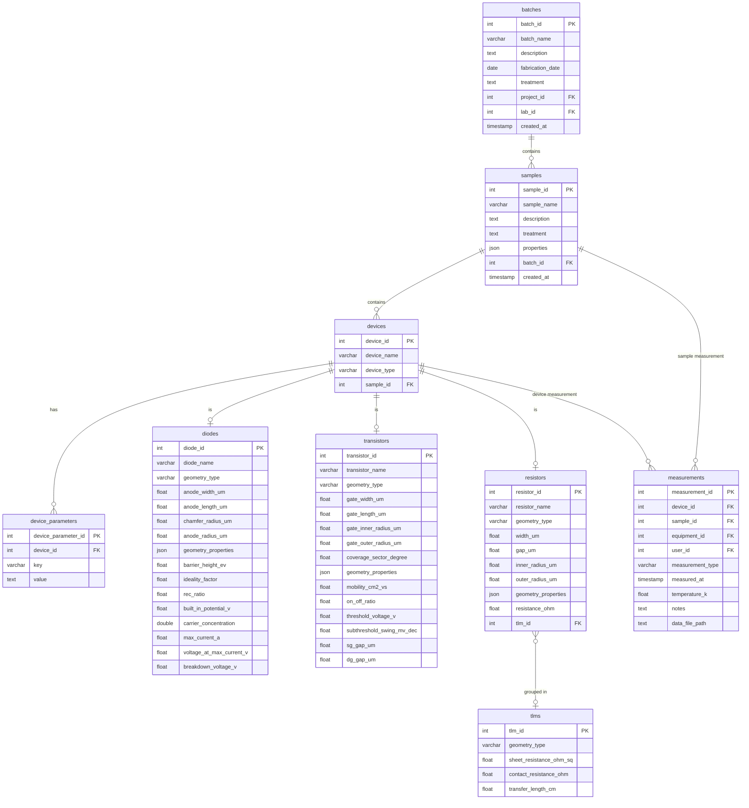

# ExpeGraph Database Schema

Full SQL definition: [`database/ExpeGraphDB_PostgreSQL.sql`](../../database/ExpeGraphDB_PostgreSQL.sql)

The schema is split into two diagrams for readability. Cross-diagram foreign keys are listed in the table at the bottom.

---

## Diagram 1 — Organisation & Auth

---

## Diagram 2 — Experimental Data

---

## Cross-Diagram Foreign Keys

| Column | Table | References |
|--------|-------|-----------|
| `project_id` | `batches` | `projects.project_id` |
| `lab_id` | `batches` | `labs.lab_id` |
| `equipment_id` | `measurements` | `equipment.equipment_id` |
| `user_id` | `measurements` | `users.user_id` |

---

## Key Design Decisions

| Decision | Rationale |
|----------|-----------|
| `samples.properties JSONB` | Sample metadata (wafer, quarter, piece number) varies by lab; JSONB avoids schema changes for each new lab type |
| `device_parameters` key-value table | Escape hatch for device types not covered by `diodes`/`transistors`/`resistors` |
| Shared PK on device extensions | `diode_id = device_id` enforces one-to-one and removes a redundant join column |
| `geometry_type` + nullable columns | Sparse columns for known geometries; `geometry_properties JSONB` absorbs unknown future types |
| `measurements` targets device OR sample | Some measurements (Hall effect, XRD, profilometry) apply to a sample before any device is fabricated |
| `CONSTRAINT measurements_target_check` | XOR enforces exactly one of `device_id` / `sample_id` is set — never both, never neither |
| No `MeasurementData` table | Sequential bulk reads favour files over row-per-point database storage |
| `data_file_path` relative to `DATA_ROOT` | Moving the data folder only requires updating one config value, not every DB record |
| `REAL` (32-bit float) | 7 significant digits is sufficient; saves space vs `DOUBLE PRECISION` |
| `tlm_id` FK uses `SET NULL` | Deleting a TLM analysis result should not delete the resistors |
| `lab_leader_id UNIQUE` | One user can lead at most one lab |
| `lab_leader_id` nullable | Breaks the circular dependency between `users` and `labs` at creation time |
| `role_start_date/end_date` on `users_roles` | Time-limited role assignments belong on the user–role relationship, not on the structural role–permission definition |
| `labs_equipment` junction table | Equipment can be shared between labs (e.g. shared TEM or XRD machine) |
| `purchase_year SMALLINT` | Year precision is sufficient; age is derived in the application |
| `connecting_str` on `equipment` | Stores VISA address or equivalent for direct instrument access |
