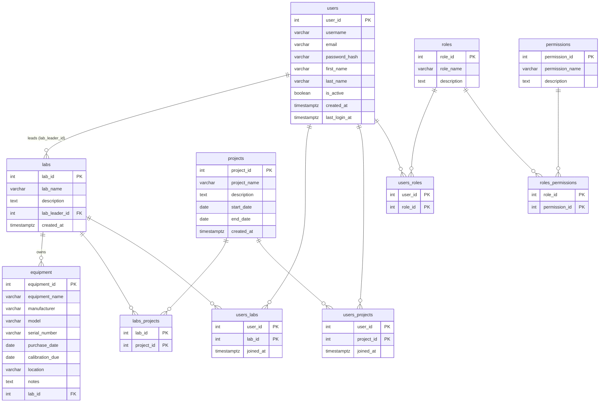
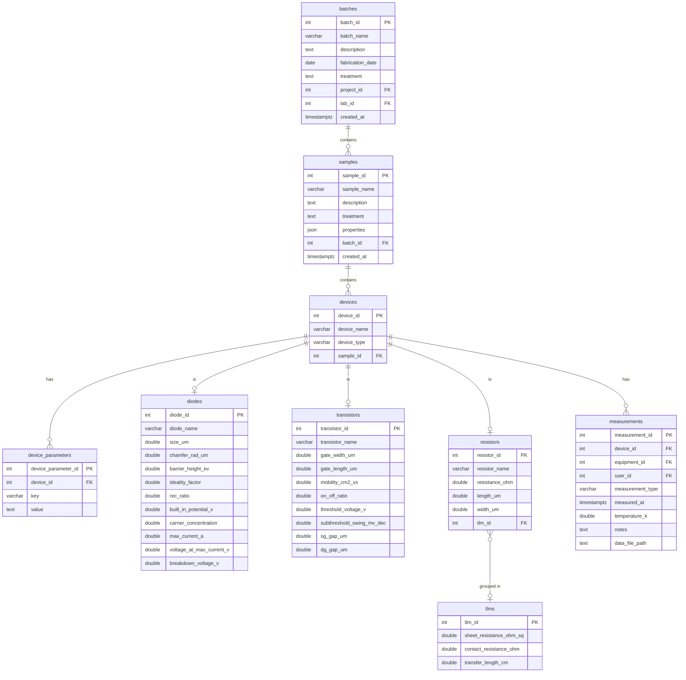

# ExpeGraph Database Schema

Full SQL definition: [`database/ExpeGraphDB_PostgreSQL.sql`](../../database/ExpeGraphDB_PostgreSQL.sql)

The schema is split into two diagrams for readability.

---

## Diagram 1 — Organisation & Auth

Covers: `users`, `labs`, `projects`, `roles`, `permissions`, `equipment`,
and all junction tables.

---

## Diagram 2 — Experimental Data

Covers: `batches`, `samples`, `devices`, `diodes`, `transistors`,
`tlms`, `resistors`, `device_parameters`, `measurements`.

---

## Cross-Diagram Links

| Column         | Table          | References               |
| -------------- | -------------- | ------------------------ |
| `project_id`   | `batches`      | `projects.project_id`    |
| `lab_id`       | `batches`      | `labs.lab_id`            |
| `equipment_id` | `measurements` | `equipment.equipment_id` |
| `user_id`      | `measurements` | `users.user_id`          |

---

## Key Design Decisions

| Decision                                 | Rationale                                                                                                       |
| ---------------------------------------- | --------------------------------------------------------------------------------------------------------------- |
| `samples.properties JSONB`               | Sample metadata (wafer, quarter, piece number) is lab-specific; JSONB avoids a table redesign for every new lab |
| `device_parameters` key-value table      | Escape hatch for device types not modelled by `diodes`/`transistors`/`resistors`                                |
| `diode_id` = `device_id` (shared PK)     | Enforces one-to-one relationship; avoids a redundant join column                                                |
| No `MeasurementData` table               | Data volume and sequential access patterns favour files over row-per-point storage                              |
| `data_file_path` relative to `DATA_ROOT` | Allows the data folder to be moved without updating every DB record                                             |
| `DOUBLE PRECISION` for all measurements  | 32-bit `FLOAT` loses precision for values like carrier concentration                                            |
| `tlm_id` FK uses `SET NULL` on delete    | Deleting a TLM analysis result should not delete the resistors themselves                                       |
| `lab_leader_id` nullable                 | Breaks the circular dependency between `users` and `labs` at creation time                                      |
